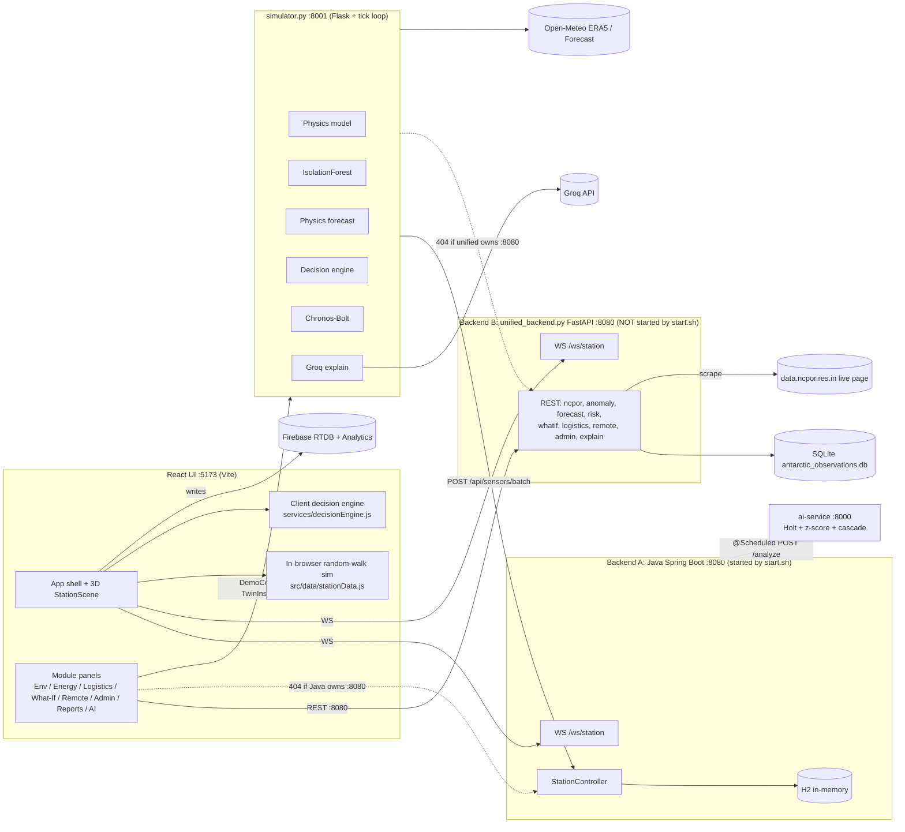
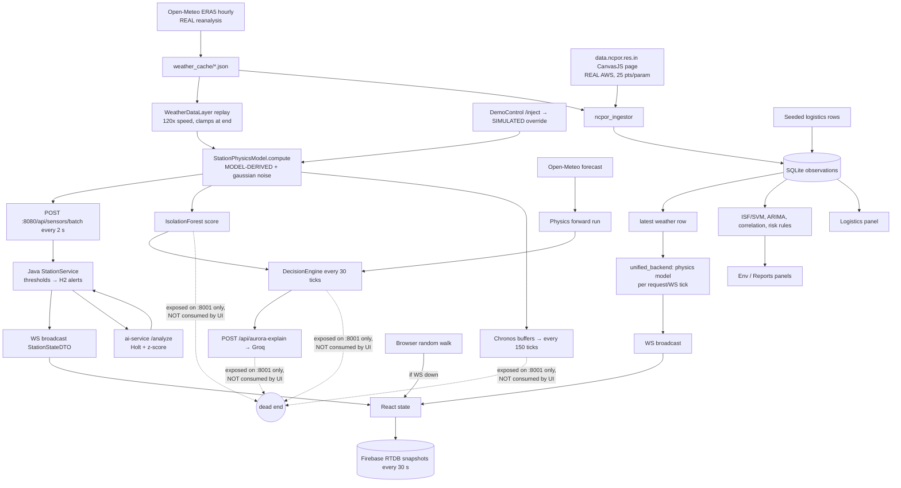

# PROJECT_CONTEXT.md — Aurora: Antarctic Station Digital Twin (SIH PS 26060)

> Original audit: **2026-09-30** · **Re-audited 2026-10-01** (§0 below is the re-audit; §1–§19 are the
> original audit, kept as the historical record with per-item status added)
>
> **Evidence labels used throughout**
> - **VERIFIED**: I ran it or directly observed it (command output, HTTP response, DB query).
> - **INFERRED**: a reasonable conclusion from reading the code, but not executed.
> - **UNKNOWN**: can't be determined from the repo.
>
> The original audit ran against a copy of the repo in a scratch directory. The re-audit ran against
> the working tree at commit `a745600` plus the two CI workflows, which execute the full stack in
> Docker on Linux.

---

## 0. Re-audit — 2026-10-01

### 0.1 What changed since the original audit

The repo is now **a git repository with CI**: 56 commits on `main`, two GitHub Actions workflows
(`ci.yml`, `docker.yml`), both green on `a745600` (runs 36887442144 and 36887442292, VERIFIED).
The original header's "not a git repository: no history, branches, or CI" no longer holds.

| Claim in the original audit | Status now |
|---|---|
| Two backends fight over :8080 | **Resolved.** `simulator/unified_backend.py` is the only backend; the Java backend and ai-service moved to `legacy/` and are not started by any script (`start.sh:10` says so explicitly, VERIFIED) |
| No tests | **Resolved.** 337 pytest (+16 `slow`, +7 `ml` deselected by default), 82 Vitest, 4 Playwright e2e; `simulator/` coverage **72%** (VERIFIED) |
| No CI | **Resolved.** ruff + pytest + coverage, lint + Vitest + build on Node 20 and 22, e2e, gitleaks; a second workflow builds multi-arch images and runs the whole compose stack including an offline phase |
| `ruff check` / lint state | `ruff check .` exits **0**; oxlint reports **27 warnings, 0 errors** (VERIFIED) |
| No deployment story | **Resolved.** `docker compose up -d` runs the three services; multi-arch images on GHCR; HTTPS and offline overlays; `docs/DEPLOYMENT.md` |
| Bundle ~1.6 MB single chunk | **440 kB entry chunk** (gzip 133 kB); three.js (535 kB) and recharts are lazy (VERIFIED) |
| No write protection | **Partially resolved.** `ADMIN_TOKEN` gates all 11 state-changing routes; nginx rate limits; `APP_ENV=production` refuses an unsafe config. Still **no user accounts or roles** |

### 0.2 Broken items (§13) — all 24 re-checked

Every B-item from §13 is addressed. Evidence is the file or test that now covers it.

| # | Status | Evidence |
|---|---|---|
| B1 | Fixed | `legacy/{backend,ai-service}`; `start.sh` starts backend → simulator → Vite only |
| B2 | Fixed | `POST /api/sensors/batch` exists; `test_api_contract.py::test_sensor_batch_ingest_is_accepted_and_grows_history` |
| B3 | Fixed | `ConvergenceTracker` (≥200 ticks + drift gate) and a retrained v3 model; `anomaly_model_card.md` documents the v2→v3 change; `test_anomaly_model.py` |
| B4 | Fixed | `simulator/requirements.txt` pins flask, numpy, pandas, scikit-learn 1.7.2, statsmodels, `uvicorn[standard]` |
| B5 | Fixed | No committed venvs; `.venv/` gitignored; `make setup` creates it |
| B6 | N/A | Java is legacy and not built |
| B7 | Fixed | `migrations/001_fix_era5_wind_units.py`; all conversion via `units.py`; `test_wind_units.py`, `test_migration_001.py` |
| B8 | Fixed | `analytics_ai_engine.py` selects newest rows (`ORDER BY timestamp DESC`) then reverses; `test_analytics_window.py` |
| B9 | Fixed | fuel read from `readings["generator"]["gen_fuel_rate"]`; `test_chronos_inputs.py` |
| B10 | Fixed | per-station inference guard; `test_chronos_inputs.py` |
| B11 | Fixed | `chronos_available()` reports the real import state; `test_chronos.py` |
| B12 | Fixed | `ExplainRequest` has `question` and `freeText`; `test_backend_ai.py` |
| B13 | Fixed | one schema via `twin_inspector.build_twin_inspector`, used by both services |
| B14 | Fixed | `DemoControl({ activeStation })` |
| B15–B17 | N/A | Java / ai-service are legacy |
| B18 | Fixed | `require_station` → 404; `test_api_contract.py` covers 8 GET routes and the POST routes |
| B19 | Fixed | replay wraps (`_last_loop`); `test_replay_and_forecast.py` |
| B20 | Fixed | single browser-demo subscription (`simUnsubRef`); `useStationData.test.js` |
| B21 | Fixed | `dataSourceRef` mirror; reconnect backoff tested |
| B22 | Fixed | `alert_engine.py` reads `alert_threshold_overrides`; `test_alerts.py` |
| B23 | Fixed | `sim_hours_per_real_minute()` used in the banner |
| B24 | Fixed | README rewritten against the code; `docs/DEPLOYMENT.md` added |

### 0.3 Action plan (§17) — current state

**P0 — all seven done.** P0-6's "rotate the Groq key" is the maintainer's action and is UNKNOWN
from the repo; everything else is in code (Firebase disabled, CORS restricted to `ALLOWED_ORIGINS`,
no `*`).

**P1 — 8 of 11 done, 3 partial, none untouched:**

| # | Status | Note |
|---|---|---|
| P1-1, P1-2, P1-4, P1-6, P1-9, P1-10, P1-11 | Done | config modules, `station_config.json` as the single source, newest-window analytics, logistics audit log, simulated command lifecycle, Chronos fixes, B13–B23 |
| P1-3 | **Partial** | Still SQLite (durable, WAL, migrations) with a 300-point in-memory buffer and history endpoints for alerts and logistics. No PostgreSQL/TimescaleDB, no retention policy, and per-sensor telemetry history is still in memory only |
| P1-5 | **Not done** | `/api/simulation/whatif` still returns narrative strings plus four deltas (25 `impacts.append` calls). It does not run `StationPhysicsModel` forward over N hours, so there are no trajectories or fuel-autonomy projections |
| P1-7 | **Partial** | The energy panel reads the physics `power_breakdown`, but there is still no battery/renewables model |
| P1-8 | **Partial** | `ADMIN_TOKEN` gates every write and the UI has an operator login, but there is no identity, no roles and no per-station scoping. The operator name on an audit record is self-declared |

**P2 — 4 of 8 done:**

| # | Status | Note |
|---|---|---|
| P2-1, P2-2, P2-5, P2-8 | Done | test suites + CI; Docker/compose with health checks and pinned bases; bundle code-split and fonts self-hosted; README rewritten and `git init` done |
| P2-3 | Not done | No edge store-and-forward prototype |
| P2-4 | Not done | One shared 3D scene for both stations; three.js still 0.128 |
| P2-6 | **Partial** | The WebSocket filters by station (`station_filter`), but five panels still poll through `usePolling` |
| P2-7 | **Partial** | Ingestion works and records its dataset honestly; there is no scheduled job, no parser unit test, and the Maitri 48 m/s wind reading is still unexplained (UNKNOWN) |

**P3 — none started** (as expected; they are post-hackathon scope).

### 0.4 Issues found during the re-audit period

These were found by the Docker/CI work and are fixed, but are recorded because each would
have reached a live deployment:

| Issue | Impact | Fix |
|---|---|---|
| nginx resolved the backend once at config load | Any recreate of the backend container (e.g. editing `.env` then `docker compose up -d`) left nginx proxying a dead IP; the whole site 502s | Per-request resolution via a variable `proxy_pass` + `resolver` |
| `add_header` is not inherited into a location that sets its own | CSP, nosniff, Referrer-Policy, X-Frame-Options, COOP and Permissions-Policy were absent on **every** response | Headers moved to an included snippet, included in each location; CI asserts them on HTML, a hashed asset and the proxied API |
| `limit_req` without `nodelay` on the explain route | Excess callers were queued 12–24 s instead of refused, and a sequential caller could never be refused at all | `nodelay`, so the 4th rapid request gets the friendly 429 |
| `AnimatePresence mode="wait"` + lazy panels | Selecting a module whose chunk was not cached left the **previous** panel on screen | Dropped `mode="wait"`; Suspense wraps AnimatePresence. The module tour now asserts each panel's own heading |
| `X-Admin-Token` missing from CORS `allow_headers` | The operator login would work in Docker (same-origin) but fail in local dev (Vite:5173 → backend:8080 preflight) | Header allowed; preflight covered by a pytest |
| The frontend image did not copy `simulator/station_config.json` | `npm run build` failed in Docker — `src/data/stationConfig.js` imports it at build time | File copied at the matching relative depth |

### 0.5 Remaining honest gaps

Unchanged from the original audit and still true:

1. **No real hardware telemetry.** Everything equipment-related is model-derived from ERA5.
2. **Ground truth is the model itself.** Forecast validation measures self-consistency, not skill.
3. **Building parameters are estimated**, not from NCPOR drawings (each carries a `basis` field).
4. **Anomaly detection is validated against synthetic degradations only.**
5. **No user accounts or roles** — one shared `ADMIN_TOKEN`; see P1-8.
6. **What-if is narrative, not simulated** — see P1-5.
7. **Thresholds are prototypes**, not certified limits.
8. The forecast arena's physics leg is still a noise approximation, so that comparison is not fair.

### 0.6 How to verify this re-audit

```bash
make test          # 337 pytest + 82 Vitest
make lint          # ruff (exits 0) + oxlint (27 warnings, 0 errors)
make coverage      # simulator/ at 72%
make e2e           # 4 Playwright specs
docker compose up -d && curl -s localhost/api/health | python3 -m json.tool
gh run list --limit 5
```

---

## 1. Executive Summary

- **What it is:** "Aurora" is a hackathon-stage digital twin prototype for India's two Antarctic stations, **Maitri** and **Bharati**. It has a React + Three.js mission-control UI, a Python physics/ML "simulator", and **two competing backends** (Java Spring Boot and a Python FastAPI "unified backend") that both claim port **8080**.
- **Maturity:** early prototype / demo-grade. There is **no real station telemetry**. Equipment "sensors" are generated by a physics model (`simulator/physics_model.py`) or a random walk. The only real-world data is **ERA5 reanalysis weather** (Open-Meteo) and a **scraped NCPOR AWS chart page** (25 points per parameter per scrape).
- **Health: ⚠️ fragmented.** Each piece mostly works in isolation (VERIFIED: the frontend builds, 35/35 physics invariants pass, 39/40 Chronos tests pass, both backends start). The system is **not integrated end-to-end**:
  - `start.sh` launches the **Java** backend on :8080. The frontend's module panels call endpoints that exist **only** in the **Python** `unified_backend.py`, and 8 of 8 probed return 404 on Java (VERIFIED).
  - If you run `unified_backend.py` on :8080 instead, the simulator's `POST /api/sensors/batch` returns **404** (VERIFIED), so the Demo Control injections never reach the UI.
- **The flagship ML pipeline isn't surfaced in the UI.** Physics residuals → IsolationForest → Chronos → decision engine → Groq all live in `simulator/simulator.py` (:8001), and the UI never calls those endpoints. The UI's "AI Diagnostics" page shows `value × 0.98` "predictions" labelled as an "LSTM residual engine" (VERIFIED, `unified_backend.py:361-386`, `AiPanel.jsx:237`).
- **The anomaly detector false-alarms continuously.** It was trained on unconverged generator temperatures (≈44 °C) while live steady state is ≈57 °C, so un-injected Bharati is permanently flagged "Possible cooling degradation" (VERIFIED).
- **Several data-integrity issues:**
  - ERA5 wind is stored in km/h but labelled m/s, which inflates wind ×3.6 downstream (VERIFIED).
  - ERA5 rows are labelled "NCPOR / IMD" sources.
  - Many UI numbers are hardcoded fallbacks.
- **Security is demo-grade:**
  - No authentication or RBAC anywhere.
  - CORS is `*` on all services.
  - The Firebase Realtime DB rules allow **public read/write**.
  - A live Groq API key sits in `simulator/.env`.
- **Offline resilience is simulated in the browser only.** No store-and-forward exists between station and mainland.
- **Pillar coverage:** Energy and Environment are partially implemented. Infrastructure is thin: 8 generic boxes, and both stations share the same 3D layout. Logistics is a seeded 10-row table with manual edits and no forecasting.

---

## 2. Problem Statement Recap

**PS 26060 (MoES / NCPOR): "Digital Platform for efficient remote management of Indian Antarctic Research Stations"** (Software · Smart Automation).
Build a Digital Twin framework for **Maitri** and **Bharati** that integrates four pillars:

| Pillar | PS scope |
|---|---|
| Infrastructure | buildings, equipment, asset health, maintenance |
| Energy | generation, consumption, fuel, storage, renewables |
| Logistics | inventory, supplies, resupply, personnel, transport |
| Environment | weather, air quality, emissions, waste, sensors |

**Our interpretation / what a judge will look for**
- A **per-station live model** (the twin) that mirrors state, fed by sensor data (real or clearly-labelled simulated), with **history**.
- **Remote management** from mainland India (Goa/NCPOR): monitoring, alerting, decision support, and possibly command/approval workflows.
- **Designed for satellite constraints:** low bandwidth, intermittent links, edge autonomy, sync-on-reconnect.
- **Smart automation:** predictive maintenance, forecasting (fuel, weather impact), optimisation (energy, resupply), what-if simulation.
- **Honest provenance:** the team's own README already commits to this (`README.md:193-197, 509-520`), and several UI labels violate it (see §14).

---

## 3. Tech Stack

| Layer | Technology | Version | Where used | Evidence |
|---|---|---|---|---|
| Frontend runtime | React / React-DOM | ^19.2.8 (installed 19.3.0) | `src/` | `package.json:18-19`, `npm ls` (VERIFIED) |
| Build tool | Vite (+ @vitejs/plugin-react) | ^8.3.0 (8.3.1) / ^6.1.1 | `vite.config.js` | VERIFIED build |
| Lint | oxlint | ^1.81.0 (1.85.0) | `.oxlintrc.json` | VERIFIED |
| 3D | three.js (+ OrbitControls) | ^0.128.0 (2021-era; current is ≥0.17x) | `src/components/StationScene.jsx` | `package.json:23` |
| Charts | recharts | ^3.10.1 | `EnvironmentalPanel.jsx` only | grep |
| Animation / icons | framer-motion ^11.18.2, react-icons ^5.7.0 | | all components | |
| Fonts | @fontsource Inter / JetBrains Mono / Space Grotesk, plus a Google Fonts `<link>` (duplicate loading) | ^5.3.0 | `main.jsx:3-13`, `index.html:11-13` | |
| Routing | react-router-dom | ^6.30.6 | **unused** (no imports) | grep (VERIFIED) |
| Cloud DB / analytics | Firebase JS SDK (Realtime DB + Analytics) | ^12.19.0 | `src/firebase.js`, `services/databaseService.js`, `services/analyticsService.js` | |
| Backend A | Java 21, Spring Boot (web, websocket, data-jpa, validation) | Boot 3.4.5, `java.version` 21 | `backend/` | `backend/pom.xml` |
| Backend A DB | H2 in-memory (default); PostgreSQL driver declared but unconfigured | Boot-managed | `application.properties:13-21` | |
| Backend B ("unified") | Python FastAPI + Uvicorn + sqlite3 + pandas | fastapi>=0.115, uvicorn>=0.32 (**no** `[standard]`, so no WebSocket lib) | `simulator/unified_backend.py` | VERIFIED |
| AI service | Python FastAPI | same | `ai-service/ai_service.py` | |
| Simulator / control API | Python Flask + flask-cors, requests | **undeclared** (requirements.txt lists only `requests`) | `simulator/simulator.py` | VERIFIED ImportError |
| ML: anomaly | scikit-learn IsolationForest (+ OneClassSVM in analytics) | pickles built with **sklearn 1.7.2**; unpinned | `simulator/anomaly_engine.py`, `*.pkl` | VERIFIED InconsistentVersionWarning |
| ML: forecasting | statsmodels ARIMA(1,1,1); numpy polyfit; Holt double-exponential smoothing | unpinned | `analytics_ai_engine.py`, `ai_service.py`, `forecast_arena.py` | |
| ML: foundation model | Amazon **Chronos-Bolt-Small** via `chronos-forecasting` 2.3.2 + PyTorch | README pins 2.3.2; not in any requirements file | `simulator/chronos_forecaster.py` | VERIFIED tests |
| LLM | Groq API, model `openai/gpt-oss-120b` | | `simulator/simulator.py:939-1000` | |
| Local persistence (Python) | SQLite `simulator/data_store/antarctic_observations.db` (2.3 MB) | | `ncpor_ingestor.py` | VERIFIED query |
| External data | Open-Meteo Archive (ERA5) + Forecast (GFS/ICON) APIs; `https://data.ncpor.res.in/{station}/live` (HTML/CanvasJS scrape) | | `weather_data.py`, `forecast_engine.py`, `ncpor_ingestor.py` | VERIFIED reachable (HTTP 200) |
| Browser APIs | Web Speech API (recognition + synthesis) | | `OverviewHUD.jsx`, `AiPanel.jsx` | |
| Deployment | **None.** No Dockerfile, compose, CI, or hosting config. `start.sh` is a local bash launcher. | | | VERIFIED (file tree) |
| Message broker | **None** | | | |

---

## 4. Repository Structure

```text
SIH2/
├── README.md                  # 615-line team doc (architecture, claims policy, demo script). Several parts stale (§14)
├── PROJECT_CONTEXT.md         # ← this file
├── start.sh                   # Launches Vite + Java backend (8080) + ai-service (8000) + simulator (8001). Does NOT start unified_backend.py
├── test_full_suite.py         # Smoke test (status codes only) against unified_backend endpoints on :8080
├── package.json / package-lock.json / vite.config.js / .oxlintrc.json / index.html
├── .env.example               # GROQ_API_KEY only
├── database.rules.json        # Firebase RTDB rules: ".read": true, ".write": true (public!)
├── .gitignore                 # ignores .env*, node_modules, dist, .DS_Store (no git repo exists)
├── logo.jpeg                  # duplicate of public/logo.jpeg (identical md5)
├── dist/                      # stale prebuilt bundle (109 assets). Contains the Firebase config
├── node_modules/              # installed
├── public/                    # favicon.svg, icons.svg, logo.jpeg
├── .claude/settings.local.json
│
├── src/                                   # ── React frontend (Vite) ──
│   ├── main.jsx                           # React root, font imports
│   ├── App.jsx                            # Shell: TopBar + SidebarNav + main stage (3D overview or module panel) + drawers/modals
│   ├── App.css, index.css                 # Glassmorphism theme
│   ├── firebase.js                        # Hardcoded Firebase web config; initialises Analytics + RTDB at import
│   ├── hooks/
│   │   ├── useStationData.js              # WebSocket client (ws://localhost:8080/ws/station) + fallback to in-browser sim + fake offline mode
│   │   ├── useDatabase.js                 # Pushes snapshots/alerts to Firebase RTDB (30 s throttle)
│   │   └── useSpotlight.js                # DEAD (unused)
│   ├── data/stationData.js                # 639 lines: STATIONS, BUILDINGS (3D layout), DEPENDENCY_GRAPH, full in-browser random-walk simulator, inventory profiles
│   ├── services/
│   │   ├── decisionEngine.js              # Client-side playbooks → "incidents" (duplicates Python logic)
│   │   ├── databaseService.js             # Firebase RTDB CRUD
│   │   ├── analyticsService.js            # Firebase Analytics events
│   │   └── groqService.js                 # DEAD: only caller of simulator :8001 /api/aurora-explain (Groq)
│   └── components/                        # 23 JSX + CSS pairs (see §11)
│
├── backend/                               # ── Java Spring Boot "Backend A" (port 8080) ──
│   ├── pom.xml                            # Boot 3.4.5, Java 21, JPA, H2, Postgres driver, websocket. No tests
│   ├── src/main/resources/application.properties   # H2 mem, create-drop, H2 console on, CORS list
│   ├── src/main/java/com/aurora/
│   │   ├── AuroraApplication.java         # @EnableScheduling
│   │   ├── config/CorsConfig.java         # allows "*" (overrides the properties list)
│   │   ├── config/WebSocketConfig.java    # /ws/station, setAllowedOrigins("*")
│   │   ├── controller/StationController.java  # 7 REST endpoints (§9)
│   │   ├── websocket/StationWebSocketHandler.java  # broadcast to all sessions
│   │   ├── service/StationService.java    # thresholds, alerts, per-station state, "delta encoding" counters, offline queue
│   │   ├── service/AiIntegrationService.java # @Scheduled POST to ai-service /analyze → alerts
│   │   ├── model/{SensorReading,Alert}.java   # JPA entities
│   │   ├── repository/*.java              # Spring Data repos
│   │   └── dto/*.java                     # SensorBatchDTO, StationStateDTO, AiVerdictDTO (AiVerdictDTO unused)
│   └── target/                            # stale compiled classes (build output)
│
├── ai-service/                            # ── FastAPI "AI service" (port 8000) ──
│   ├── ai_service.py                      # Holt smoothing "ChronosForecaster" (NOT Chronos) + z-score + dependency cascade
│   ├── requirements.txt                   # fastapi, uvicorn, pydantic
│   └── venv/                              # Windows venv (Scripts/, Lib/). Unusable on macOS/Linux
│
└── simulator/                             # ── Python physics + ML + second backend ──
    ├── simulator.py                       # Flask control API :8001 + tick loop (2 s) for both stations; POSTs to :8080/api/sensors/batch; Groq explain
    ├── unified_backend.py                 # FastAPI "Backend B" on :8080 (REST + WS). Serves most frontend panels
    ├── physics_model.py                   # StationPhysicsModel: weather → heat loss → heating → power → generator → fuel, water, comms, CO2
    ├── weather_data.py                    # Open-Meteo ERA5 download/cache + accelerated replay
    ├── anomaly_engine.py                  # 19-feature IsolationForest; trainer in __main__ (overwrites .pkl)
    ├── forecast_engine.py                 # Physics forward run with Open-Meteo forecast (+30 min … +24 h)
    ├── decision_engine.py                 # Rule-based risk matrix R001-R005 + templates + audit trail
    ├── chronos_forecaster.py              # Chronos-Bolt-Small wrapper, per-station 1-min history buffers
    ├── analytics_ai_engine.py             # ISF/OC-SVM, ARIMA/poly forecast, correlation, blizzard risk on SQLite obs
    ├── ncpor_ingestor.py                  # SQLite schema + seed inventory + NCPOR HTML scrape + ERA5 cache import
    ├── forecast_arena.py                  # Offline benchmark (baseline vs "physics" vs Chronos); writes forecast_arena_results.md
    ├── forecast_arena_results.md          # Committed results (2026-09-29)
    ├── validate_baseline.py               # Physics correlation checks; writes baseline_data.json
    ├── test_physics_invariants.py         # 35 assertions (script-style, not pytest)
    ├── test_chronos.py                    # 40 assertions (script-style)
    ├── test_forecast_validation.py        # Physics forward-run self-consistency (walk-forward on ERA5)
    ├── requirements.txt                   # only `requests>=2.31` (severely incomplete)
    ├── .env                               # contains a real GROQ_API_KEY (gitignored pattern, but present)
    ├── .venv/                             # venv built on another Mac (<teammate-home>/...). Broken python symlinks
    ├── anomaly_model_maitri.pkl / anomaly_model_bharati.pkl   # 2.6 MB each, sklearn 1.7.2
    ├── baseline_data.json                 # 92 KB, output of validate_baseline.py
    ├── data_store/antarctic_observations.db   # SQLite, 2.3 MB (see §10)
    └── weather_cache/                     # 15 JSON files: ERA5 7-day windows (2024-01-14, 2024-07-15, 2024-09-15, 2025-10-14, 2026-08-30, 2026-08-31) ×2 stations + 2 forecast caches
```

**Data files present (not code):** `simulator/*.pkl` (2), `simulator/baseline_data.json`, `simulator/data_store/antarctic_observations.db`, `simulator/weather_cache/*.json` (15), `logo.jpeg` ×2, `public/*.svg`.

---

## 5. Architecture

### 5.1 High-level architecture (as it actually exists)



> ⚠️ Only **one** of Backend A / Backend B can bind :8080 at a time. Neither combination gives a fully working UI (see §13).

### 5.2 Data flow



### 5.3 Component-by-component

| Component | What it really does | Evidence / status |
|---|---|---|
| **`physics_model.py`** | Deterministic causal chain: per-building UA·ΔT·wind heat loss − internal gains → heating demand (capped) → electric heating (1 − waste-heat recovery) + base loads → generator load → Willans-line fuel, first-order generator temp, RPM droop. Also water balance, comms attenuation vs wind, steady-state CO₂. Gaussian noise added. Parameters are labelled documented / estimated / assumed. | VERIFIED 35/35 invariants. Spares never change; comms `bandwidth_Mbps` is emitted with unit `"kbps"` (`:95,400,463`). |
| **`weather_data.py`** | Downloads a 7-day ERA5 window (default: *today − 30 d*, so a network fetch is needed on a new day), caches it, and replays it at `speed_factor`. Linear interpolation. **Clamps at the last hour**, so after about 84 real minutes at 120×, weather freezes. | `:67, :162-166` (INFERRED clamp; VERIFIED cache hit) |
| **`simulator.py`** | Two `StationSimulator` instances; 2 s tick; REANALYSIS mode (physics) or SIMULATION mode (random walk, organic weather patterns, cascades). Flask control API on :8001 (§9). Pushes each tick to `BACKEND_URL` (hardcoded `http://localhost:8080/api/sensors/batch`). Hosts the Groq explanation endpoint. | VERIFIED runs. The `/mode` endpoint rebuilds the station objects while the tick thread iterates over them (race, INFERRED). |
| **`anomaly_engine.py`** | 19 features (base, ratio, physics residual, temporal rates). IsolationForest trained on synthetic "normal" sequences, evaluated against 4 synthetic degradation types. Rule-based candidate-cause matcher. | **Trained on unconverged data** (3 warm-up ticks). **Live false positives** (VERIFIED §13). Training dt 120 s vs live 2 s. |
| **`forecast_engine.py`** | Clones the physics state and runs it forward on the Open-Meteo forecast (+30 min…+24 h), then derives risk factors and a template recommendation. | The forecast is fetched **only at init** (`:183-186`), and uses `utcnow` while current weather is a *replayed past date*, so the "temperature delta" mixes time bases (INFERRED). |
| **`decision_engine.py`** | Rules R001-R005 with weights → risk level; event/impact/recommendation templates; audit trail. | VERIFIED self-test. Provenance claims "validated: sub-1°C MAE" (`:478`), which is only self-consistency (§13). |
| **`chronos_forecaster.py`** | Per-station 1-min downsampled buffers (max 512); every 150 ticks runs Chronos-Bolt-Small for 12 min (not 1 h) on 3 signals. | VERIFIED 39/40 tests. **Live `fuel_rate_Lhr` buffer never fills** (VERIFIED `context_length: 0`). |
| **`unified_backend.py`** | FastAPI app that recomputes physics telemetry from the **latest SQLite weather row** on every request and every 2 s WS tick; also serves analytics, what-if (hand-written rules), logistics CRUD, fake remote dispatch, admin config, and a template "explanation". | VERIFIED all GET/POST endpoints (§9). WS needs the undeclared `websockets` package (VERIFIED). |
| **`analytics_ai_engine.py`** | ISF/OC-SVM re-fit on each request over up to 1000 obs; ARIMA(1,1,1)/polyfit forecast with 95 % CI; Pearson correlation; wind-chill-based blizzard/cold risk rules. | Queries `ORDER BY timestamp ASC LIMIT n`, so it forecasts from the **oldest** data (VERIFIED: forecast starts 2026-09-03). |
| **`ncpor_ingestor.py`** | Creates 5 SQLite tables, seeds 10 inventory items, scrapes the CanvasJS series from `data.ncpor.res.in/{station}/live`, and imports ERA5 caches. | VERIFIED scrape works today (100 records). ERA5 unit bug (§13). |
| **Java backend** | Receives batches; keeps per-station latest values in memory; persists **every reading** to H2; threshold → `Alert` rows (dedup until ack); "delta-encoding" is only a counter; offline queue for the (maitri-only) toggle; schedules ai-service calls every 2 s; WS broadcast. | VERIFIED build + run (JDK 24). No tests. |
| **ai-service** | Holt smoothing per `station.building.sensor`; z-score of one-step error vs **static** profile std; dependency cascade over a hardcoded graph. | VERIFIED. `/predictions` groups by station, not building (VERIFIED bug). Class is named `ChronosForecaster`, and Java labels its alerts `source="chronos"`, which is misleading. |
| **React app** | Single page with module switching via state (no router). The 3D overview is procedural three.js boxes. Module panels poll REST every ~3 s. | VERIFIED build. §11. |
| **Firebase** | Browser writes a snapshot every 30 s plus alert logs to a public RTDB; logs Analytics events. Read APIs exist but nothing calls them. | INFERRED (not executed against the live Firebase project, deliberately). |

---

## 6. How to Run

### 6.1 Prerequisites (as actually needed)

| Tool | Needed | Notes |
|---|---|---|
| Node.js | ≥18 (tested 25.9.0) | VERIFIED |
| Python | 3.10+ (tested 3.13.1) | Create **your own** venv: both committed venvs are machine-specific and broken (VERIFIED). |
| JDK | **≥21** | Default `java` on this machine is 17, which fails with "release version 21 not supported" (VERIFIED). JDK 24 works. |
| Maven | 3.9+ | **Not installed and no `mvnw` wrapper in repo** (README says `./mvnw`, which doesn't exist; VERIFIED). |
| Network | Open-Meteo (ERA5 + forecast), data.ncpor.res.in, Groq, Firebase, Google Fonts | All reachable today (VERIFIED HTTP 200 for Open-Meteo/NCPOR). |

### 6.2 Environment variables (names only)

| Name | Used by | Required? |
|---|---|---|
| `GROQ_API_KEY` | `simulator/simulator.py:939` | Optional (explanations degrade to a message) |
| `AURORA_MODE` | `simulator.py:64` (`reanalysis`/`simulation`) | Optional |
| `AURORA_DATE` | `simulator.py:65` (YYYY-MM-DD replay start; default today − 30 d, so a download is triggered) | Recommended: set to a cached date, e.g. `2026-08-31` |
| `AURORA_SPEED` | `simulator.py:66` (default 120) | Optional |
| `HF_HOME` | HuggingFace cache for Chronos weights (~190 MB) | Optional |

No env vars exist for backend URLs, ports, DB, or the Firebase config; all are hardcoded (§14).

### 6.3 Commands and results

> **Re-audit note (2026-10-01):** superseded. Use `make setup`, `make dev`, `make test`,
> `make lint`, `make e2e`, or `docker compose up -d`. The script-style test files referenced
> below were converted to pytest and deleted; see §0.6.

| # | Command | Result |
|---|---|---|
| 1 | `npm install` | Already installed; `npm ls` OK (VERIFIED) |
| 2 | `npm run lint` | **0 errors, 141 warnings** (unused imports, hook deps, use-before-define, setState in effect) (VERIFIED) |
| 3 | `npm run build` (ran as `npx vite build --outDir <scratch>`) | **Success in 236 ms**; single JS chunk **1.62 MB** (448 KB gzip) with a >500 kB warning (VERIFIED) |
| 4 | `npm run dev` | Not started (build success and static review suffice). INFERRED to work on :5173. |
| 5 | `python3 -m venv .venv && pip install -r simulator/requirements.txt -r ai-service/requirements.txt` | Installs, but then `import simulator` fails with `No module named 'flask'` and `import unified_backend` fails with `No module named 'numpy'` (VERIFIED) |
| 6 | `pip install flask flask-cors numpy pandas scikit-learn statsmodels websockets` | **Actually required** (VERIFIED). Add `torch chronos-forecasting==2.3.2` for Chronos. |
| 7 | `cd simulator && python test_physics_invariants.py` | **35 passed, 0 failed** (VERIFIED) |
| 8 | `cd simulator && python decision_engine.py` | Self-test OK: R001+R002 fire, audit trail 5 steps (VERIFIED) |
| 9 | `cd simulator && python test_chronos.py` (with torch + chronos) | **39/40 pass**; failure: "Inference completed in <30s (got 33.8s)" on cold model load (VERIFIED) |
| 10 | `cd simulator && python test_forecast_validation.py` | Runs; gen-temp MAE 0.48-0.93 °C for 1-24 h. This is physics-vs-itself with perfect weather (VERIFIED) |
| 11 | `cd simulator && python unified_backend.py` | Starts on :8080 (VERIFIED). A deprecation warning for `@app.on_event`. |
| 12 | `cd ai-service && python ai_service.py` | Starts on :8000 (VERIFIED) |
| 13 | `cd simulator && AURORA_DATE=2026-08-31 python simulator.py` | Starts on :8001, cache hit, all engines "initialized" (VERIFIED). Posts to :8080 → **404** when unified backend is running (VERIFIED). |
| 14 | `python test_full_suite.py` (vs unified backend) | **All [PASS]** (VERIFIED). It only checks status codes. |
| 15 | `cd backend && mvn spring-boot:run` (JDK 17) | **Fails**: `release version 21 not supported` (VERIFIED) |
| 16 | `cd backend && JAVA_HOME=<jdk≥21> mvn test` | BUILD SUCCESS, **"No tests to run"** (VERIFIED) |
| 17 | `cd backend && JAVA_HOME=<jdk≥21> mvn spring-boot:run` | Starts in 1.9 s; simulator batches accepted; alerts generated; ai-service integration works (VERIFIED) |
| 18 | `./start.sh` | Not run as-is. It would start Java (fails on JDK 17 / no mvn) + system `python3` (missing deps). INFERRED broken on a fresh machine. |
| 19 | `python anomaly_engine.py` / `validate_baseline.py` / `forecast_arena.py` | **Not run on purpose**: they overwrite committed artefacts (`*.pkl`, `baseline_data.json`, `forecast_arena_results.md`). |

**Recommended working recipe today** (VERIFIED piecewise):
```bash
python3 -m venv .venv && source .venv/bin/activate
pip install -r simulator/requirements.txt -r ai-service/requirements.txt \
            flask flask-cors numpy pandas scikit-learn statsmodels websockets
# optional: pip install torch "chronos-forecasting==2.3.2"
(cd simulator && python unified_backend.py) &      # :8080 (serves the UI panels + WS)
(cd simulator && AURORA_DATE=2026-08-31 python simulator.py) &   # :8001 (Demo Control, Twin Inspector replay)
npm run dev                                          # :5173
# Java backend + ai-service are alternative, NOT complementary (port 8080 clash)
```

---

## 7. Feature Inventory

Legend: ✅ Working · ⚠️ Partial · 🧪 Mock/Stub · ❌ Broken · ⬜ Not started

| Feature | Pillar | Status | Evidence | Notes |
|---|---|---|---|---|
| 3D station overview (click/hover buildings, alert colouring) | Infra | ⚠️ | `StationScene.jsx`, `stationData.js:37-111` | Procedural boxes; **same layout for Maitri and Bharati**; no real geometry/BIM; three r128 |
| Station switcher Maitri/Bharati | All | ✅ | `App.jsx:176-180`, `useStationData.js:106` | Client-side filter of WS messages |
| Live telemetry via WebSocket | All | ⚠️ | `useStationData.js:70-169` | Works with Java, or with unified + `websockets` installed; otherwise silently switches to the browser random-walk |
| Browser fallback simulator | All | 🧪 | `src/data/stationData.js` | Random walk; shown as if live (dataSource only in Connection drawer) |
| Physics-based telemetry (ERA5 → equipment) | Energy/Env | ✅ | `physics_model.py` | Model-derived, not sensors |
| NCPOR AWS live ingest | Env | ⚠️ | `ncpor_ingestor.py:185-277` | HTML/CanvasJS scrape; 25 pts/param; manual trigger only; fragile |
| Historical weather charts / observations | Env | ✅ | `EnvironmentalPanel.jsx`, `/api/ncpor/observations` | Mixes ERA5 + NCPOR under "Official NCPOR" badge |
| Weather anomaly detection (ISF/SVM on obs) | Env | ⚠️ | `analytics_ai_engine.py:52-109` | Refit per request; contamination fixed 8 %, so it always finds ~8 % "anomalies" |
| Weather forecast (ARIMA / trend) | Env | ❌ | `analytics_ai_engine.py:111-188` | Uses oldest 500 rows and concatenates disjoint periods; provenance claims "real NCPOR" |
| Correlation matrix | Env | ✅ | `/api/correlation` | |
| Blizzard / cold risk | Env | ⚠️ | `analytics_ai_engine.py:223-329` | Rule-based; wind input corrupted for ERA5 rows (unit bug) |
| Air quality / emissions / waste | Env | ⬜ | none | Only indoor CO₂ (model-derived) |
| Energy dashboard | Energy | 🧪 | `ModulePanels.jsx:181-369` | Fixed load split %, hardcoded 185 000 L fuel, 4 800 L day tank, "Rated 250 kW", oil pressure/vibration fallbacks, static GEN-SET status |
| Renewables / battery / storage | Energy | ⬜ | none | Battery only appears as what-if text |
| Fuel autonomy | Energy/Logi | ⚠️ | `unified_backend.py:539-545` | Uses hardcoded 68 400 / 112 000 L, not the inventory table |
| Physics forward forecast (+24 h) | Energy | ⚠️ | `forecast_engine.py` | Works on :8001 only; **not shown in UI** |
| Chronos-Bolt forecast | Energy | ⚠️ | `chronos_forecaster.py` | Works (tests); 12-min horizon; fuel signal empty live; **not shown in UI** |
| Equipment anomaly detection (IsolationForest) | Infra | ❌ | `anomaly_engine.py`, `/api/anomaly` :8001 | Continuous false positives (VERIFIED); **not shown in UI** |
| Decision engine / risk rules | All | ⚠️ | `decision_engine.py` | Works, but driven by the broken anomaly input; **not shown in UI** |
| Groq LLM explanation | All | ⚠️ | `simulator.py:1003-1069` | Works on :8001 with key; **UI calls :8080 instead**, which returns a fixed template that ignores the question (VERIFIED) |
| Voice assistant ("JARVIS") | All | 🧪 | `OverviewHUD.jsx:42-160`, `AiPanel.jsx:104-154` | Speech in/out works in browser; backend ignores `freeText`, so every answer is the same briefing |
| AI Diagnostics table | Infra | 🧪 | `AiPanel.jsx`, `unified_backend.py:361-386` | `predicted = actual × 0.98`; labelled "LSTM residual engine", "Neural Models"; mock fallbacks |
| Threshold alerts (Java) | All | ✅ | `StationService.java:48-62,138-150` | Thresholds tuned for random-walk nominals, so false warnings in physics mode (VERIFIED) |
| Threshold alerts (unified) | All | ⚠️ | `unified_backend.py:203-255` | Only gen_temp + wind; ignores admin thresholds |
| Dependency cascade alerts | Infra | ✅ | `ai_service.py:224-280` | Hardcoded graph (3 inconsistent copies) |
| Alert acknowledge | All | ⚠️ | Java: real; unified: `acknowledge_alert` is a no-op returning success | |
| Client-side incidents / playbooks | All | 🧪 | `services/decisionEngine.js` | Claims actions ("Backup generator activated") that never happen |
| What-if simulation (7 scenarios) | All | 🧪 | `unified_backend.py:564-719` | Hand-coded deltas and fixed risk scores; narrative text (e.g. "3.8 h battery", vessel name) is invented |
| Logistics inventory view/edit | Logi | ⚠️ | `/api/logistics`, `LogisticsPanel.jsx` | 10 seeded rows; edits persist in SQLite; no validation; no auth |
| Resupply planning / forecasting / personnel / transport | Logi | ⬜ | none | Only a what-if text scenario |
| Remote command & control | Infra | 🧪 | `unified_backend.py:820-849` | Writes a DB row with status "executed", fake 85 ms; toggles in UI are local state |
| Satellite link toggle / offline mode | All | 🧪 | `useStationData.js:225-262`, `StationController.java:68-77` | Browser-only simulation; Java toggle ignores `stationId` (always maitri); bandwidth numbers fabricated |
| Digital Twin Inspector (causal chain, assumptions, replay) | Energy | ⚠️ | `TwinInspector.jsx` | Expects the :8001 schema; if unified backend is up it returns a **different schema with 200**, so the panels render empty (INFERRED from field diff) |
| Historical replay (date/speed) | Env | ✅ | `TwinInspector.jsx:62-81`, `simulator.py:889-908` | Rebuilds simulators; downloads ERA5 if uncached |
| Demo scenario injection | Infra | ⚠️ | `DemoControl.jsx:33-78` | Ignores active station (always Maitri); reaches UI only via the Java backend |
| Reports (print/JSON/CSV) | All | ⚠️ | `ReportPanel.jsx` | Works; silently substitutes hardcoded weather/risk if fetch fails |
| Admin: users/roles | All | 🧪 | `unified_backend.py:898-903` | Static list; no auth |
| Admin: thresholds | All | 🧪 | `AdminPanel.jsx:41-45` | UI "save" doesn't call the API; the API updates a dict nothing reads |
| Persistence: Java/H2 | All | ⚠️ | `application.properties:13-21` | In-memory, `create-drop`, so all history is lost on restart |
| Persistence: Firebase RTDB | All | ⚠️ | `useDatabase.js`, `databaseService.js` | Write-only in practice; public rules |
| Persistence: PostgreSQL | All | ⬜ | `pom.xml:42-46` | Driver only |
| Authentication / RBAC | All | ⬜ | none | |
| Offline sync (station edge ↔ mainland) | All | ⬜ | none | |
| Predictive maintenance (RUL, schedules) | Infra | ⬜ | none | |
| Energy optimisation | Energy | ⬜ | none | |

---

## 8. PS Coverage Matrix

| Pillar | Maitri | Bharati |
|---|---|---|
| **Infrastructure** | 8 generic "buildings" (generator, heating A/B, water, comms, LQ, storage, lab) with model-derived sensors; procedural 3D; threshold + cascade alerts; broken ISF anomaly. No asset registry, maintenance logs, or RUL. | **Identical** building set, 3D layout and dependency graph (Bharati is really a single integrated building). Physics params differ slightly (`physics_model.py:106-175`). |
| **Energy** | Single diesel generator model (200 kW est.), heating demand, fuel burn, Willans line; physics forecast + Chronos (not in UI); Energy panel largely hardcoded. No renewables, battery, or multi-genset. | Same model, 220 kW est., better insulation/recovery params. Same gaps. |
| **Logistics** | 5 seeded inventory items (fuel, food, med, spares, water), days-remaining = current/daily, manual edits; what-if "resupply delay" text. No personnel, transport, voyages, or forecasting. | Same (5 items, larger quantities). |
| **Environment** | ERA5 replay (7-day windows) + NCPOR AWS scrape (temp, wind, pressure, RH; 25 pts); ISF/SVM, ARIMA, correlation, blizzard risk. Indoor CO₂ model only. No air-quality, emissions, or waste. | Same data paths; NCPOR Bharati page scrape also works. ERA5 coordinate elevation inconsistent (50 m vs 35 m). |

---

## 9. API Reference

### 9.1 Java Spring Boot (`backend/`, :8080): `StationController.java`

> **Re-audit note:** moved to `legacy/backend/`. Not started, not extended, and no longer
> binds :8080.

| Method | Path | Purpose | Request → Response | Status |
|---|---|---|---|---|
| POST | `/api/sensors/batch` | Ingest simulator tick; store, threshold, broadcast | `SensorBatchDTO {stationId, timestamp, readings{bld{sensor{value,unit}}}, eventTimeline[], activePatterns[]}` → `StationStateDTO` | ✅ VERIFIED |
| GET | `/api/station/{stationId}/state` | Current state | → `StationStateDTO {stationId, timestamp, sensors{bld{sensor:double}}, alerts{bld:level}, activeAlerts[], connected, bandwidth{rawBytes,compressedBytes,savedKB}, eventTimeline, activePatterns}` | ✅ VERIFIED |
| POST | `/api/alerts/{alertId}/acknowledge` | Ack alert (Long id) | → 200 empty | ✅ INFERRED |
| POST | `/api/connection/toggle` | Toggle simulated link | ignores `?stationId`; always maitri → `{connected, offlineQueueSize}` | ⚠️ VERIFIED bug |
| POST | `/api/connection/{state}` | Set link (`connect`/`true`) | → `{connected, offlineQueueSize}` | ⚠️ maitri only |
| GET | `/api/ai/analysis?stationId=` | Latest ai-service health + dependency alerts | → `{stationId, overallHealth, dependencyAlerts[], hasAnalysis}` | ✅ VERIFIED |
| GET | `/api/health` | Health | → `{status, service, wsClients, connected, aiHealth}` | ✅ VERIFIED |
| WS | `/ws/station` | Push `StationStateDTO` per batch (both stations to all clients) | server → client JSON | ✅ INFERRED (handler reviewed) |
| GET | `/h2-console` | H2 web console (enabled, `sa`/empty password) | | ⚠️ security |

### 9.2 Python unified backend (`simulator/unified_backend.py`, :8080)

| Method | Path | Purpose | Request → Response | Status |
|---|---|---|---|---|
| WS | `/ws/station` | Every 2 s: physics telemetry for both stations | → `{stationId, timestamp, sensors, alerts, activeAlerts, aiHealth, provenance}` (no bandwidth/connected/eventTimeline) | ✅ only with `websockets` installed (VERIFIED) |
| GET | `/api/stations` | Station metadata (static) | → list | ✅ |
| GET | `/api/sensors/latest?stationId=` | Physics telemetry from latest weather row | → same as WS | ✅; unknown station → **500** (VERIFIED) |
| GET | `/api/ai/analysis` | Blizzard risk summary | → `{overallHealth, riskScore, windChill, currentWeather, dependencyAlerts, provenance}` | ✅ |
| GET | `/api/predictions` | "Predictions" | → `predicted = actual*0.98` for every sensor | 🧪 VERIFIED |
| GET | `/api/ncpor/live` | Latest weather | → `{weather{temperature_c, wind_speed_ms, …, source, dataset}}` | ✅ (labels ERA5 rows as NCPOR AWS) |
| POST | `/api/ncpor/ingest?stationId=` | Scrape NCPOR live page(s) | query param (frontend sends JSON body, which is ignored, so both stations are ingested) → `{status, results}` | ✅ VERIFIED 100 records |
| GET | `/api/ncpor/observations?stationId&parameter&limit` | Raw obs (oldest-first) | → `{records[]}` | ✅ |
| GET | `/api/anomaly?stationId&parameter&algorithm=isf\|svm` | Weather anomaly | → `{results[{timestamp,value,is_anomaly,anomaly_score}], anomalies_count}` (~140 KB) | ✅ |
| GET | `/api/forecast?…&model=arima\|trend&horizon=` | Weather forecast | → `{historical[], forecast[{predicted, lower_bound, upper_bound}]}` | ❌ uses stale/oldest data (VERIFIED) |
| GET | `/api/correlation` | Pearson matrix | → `{parameters, correlation_matrix}` | ✅ |
| GET | `/api/risk` | Blizzard/cold rules | → `{overall_health, risk_score, wind_chill_c, identified_risks[]}` | ✅ |
| GET | `/api/twin-inspector?station=` | Causal chain | → `{causalChain{thermal,electrical,generator,logistics}, assumptions[]}` | ⚠️ schema ≠ what `TwinInspector.jsx` reads |
| POST | `/api/simulation/whatif` | What-if | `{stationId, scenarioId, intensity}` → `{baseline, simulated, deltas, affectedSubsystems, consequences[], calculatedRisk{score,level,recommendedAction}}` | 🧪 VERIFIED (rules) |
| POST | `/api/connection/toggle?stationId=` | Per-station flag | → `{connected}` | 🧪 flag has no effect |
| GET | `/api/connection/status` | | → `{connected}` | 🧪 |
| POST | `/api/alerts/{id}/acknowledge` | | always `{acknowledged:true}` | 🧪 no-op (VERIFIED) |
| GET | `/api/logistics?stationId=` | Inventory | → `{items[{id,name,category,current,max,unit,dailyUse,reorderAt,daysRemaining,isLow,lastUpdated,updatedBy,provenance}]}` | ✅ |
| POST | `/api/logistics/update` | Edit item | `{stationId,itemId,current,dailyConsumption?,updatedBy}` → success even for unknown id / negative values (VERIFIED) | ⚠️ |
| POST | `/api/remote/dispatch` | "Dispatch" command | `{stationId,subsystem,command,parameters?,issuedBy}` → `{commandId, executionTimeMs:85}` | 🧪 VERIFIED |
| GET | `/api/remote/commands` | Last 50 commands | → `{commands[]}` | ✅ |
| GET | `/api/alerts` | Current alerts (recomputed) | → `{activeAlerts, alerts}` | ✅ |
| GET/POST | `/api/admin/config` | System info, static users, thresholds dict | POST `{thresholds{k:float}}` | 🧪 thresholds unused |
| POST | `/api/aurora-explain`, `/api/explain` | Template briefing | `{station, evidence?, subsystem?}` (question/freeText ignored) → `{explanation}` | 🧪 VERIFIED; unknown station → 200 |
| — | `/api/station/{id}/state`, `/api/health`, `/api/sensors/batch` | **Missing** (404) | | ❌ VERIFIED |

### 9.3 Simulator control API (`simulator/simulator.py`, :8001, Flask)

| Method | Path | Purpose | Status |
|---|---|---|---|
| GET | `/scenarios?station=` | Scenario list + active state + data source | ✅ VERIFIED |
| POST | `/inject/<scenario_id>?station=` | Inject (generator_failure, heating_failure, blizzard, water_crisis, co2_spike) | ✅ VERIFIED (unknown → `{error}` with 200) |
| POST | `/inject-single` | `{stationId, buildingId, sensorId, target, duration}` | ✅; no body → 415 (VERIFIED) |
| POST | `/reset?station=` | Reset station | ✅ INFERRED |
| POST | `/mode` | `{mode, date, speed}` rebuilds both stations | ⚠️ race with tick loop (INFERRED) |
| GET | `/health` | Per-station tick/mode info | ✅ VERIFIED |
| GET | `/api/twin-inspector?station=` | Causal chain + labelled assumptions | ✅ VERIFIED |
| GET | `/api/anomaly?station=` | ISF score, evidence, candidate causes | ❌ false positives (VERIFIED) |
| GET | `/api/forecast?station=` | Physics forecast (after 30 ticks) | ✅ INFERRED |
| GET | `/api/decision?station=` | Decision JSON + audit trail | ✅ VERIFIED |
| GET | `/api/chronos-forecast?station=`, `/api/chronos-status` | Chronos cache/status | ✅ VERIFIED |
| POST | `/api/aurora-explain` | `{question: status\|why\|action\|detail, station, freeText}` → Groq | ✅ INFERRED (key not used in audit) |
| POST | `/api/explain`, `/api/explain/incident` | Legacy Groq wrappers | ⚠️ only called by dead `groqService.js` |

### 9.4 AI service (`ai-service/ai_service.py`, :8000)

> **Re-audit note:** moved to `legacy/ai-service/`. Not started.

| Method | Path | Purpose | Status |
|---|---|---|---|
| POST | `/analyze` | `{stationId, buildings[{buildingId, sensors[{sensorId,value,unit}]}]}` → `{verdicts[], dependencyAlerts[], overallHealth}` | ✅ VERIFIED via Java |
| GET | `/dependency-graph` | Nodes/edges | ✅ INFERRED (unused by UI) |
| GET | `/predictions` | Holt state per sensor | ❌ grouped by **station** instead of building (VERIFIED) |
| GET | `/health` | | ✅ VERIFIED |

---

## 10. Data Layer

### 10.1 Stores

| Store | Schema | Lifetime | Evidence |
|---|---|---|---|
| **H2 (Java)** | `sensor_readings(id, stationId, buildingId, sensorId, sensorValue, unit, recordedAt)`; `alerts(id, stationId, buildingId, sensorId, level, source, message, timestamp, acknowledged, acknowledgedAt)` | In-memory, `ddl-auto=create-drop`, **lost on restart**. Grows by ~31 rows × 2 stations every 2 s (≈2.7 M rows/day) with no retention, so heap exhaustion is likely during long runs (INFERRED) | `model/*.java`, `application.properties:13-21` |
| **SQLite** `simulator/data_store/antarctic_observations.db` | `observations` (unique station/timestamp/parameter/dataset; 3 indexes), `ingestion_logs`, `logistics_inventory`, `remote_commands`, `station_alerts` (**never written**) | File, committed with demo data (9 remote commands) | `ncpor_ingestor.py:46-165`, VERIFIED query |
| **Firebase RTDB** `<firebase-project-id>` | `sensor_snapshots/{station}/{push}`, `alert_history/{station}/{push}`, `station_config/{station}`, `daily_summaries/{station}/{date}` | Cloud; **public read/write** | `databaseService.js`, `database.rules.json` |
| **In-memory** | Java `ConcurrentHashMap`s; Python `STATION_STATE`, `SYSTEM_THRESHOLDS`; simulator objects; browser `historyRef` (60 points) | Process lifetime | |
| **Files** | ERA5 caches, forecast caches, `.pkl` models, `baseline_data.json` | Committed | |

### 10.2 SQLite contents (VERIFIED, repo copy)

| Station | Dataset (label in DB) | Actual origin | Rows | Period |
|---|---|---|---|---|
| maitri / bharati | `Antarctic-ERA5-Reanalysis`, source "NCPOR / ECMWF Polar Climate Reanalysis", sensor names "IMD/ERA5 Temperature", "10m Anemometer" | **Open-Meteo ERA5** (not NCPOR/IMD) | 2 880 each (576 × 5 params) | 6 disjoint 7-day windows, 2024-07-15 → 2026-09-06 |
| maitri / bharati | `NCPOR-AWS-Live`, "NCPOR Official Data Portal" | **Real** NCPOR AWS page scrape | 100 each (25 × 4 params) | 2026-09-27 17:30 → 2026-09-28 17:30 |
| both | `logistics_inventory` | **Hardcoded seed** | 10 | |
| both | `ingestion_logs` | 8 success, 4 failed (connection errors) | 12 | 2026-09-29/30 |

**Unit bug (VERIFIED):** ERA5 `wind_speed` is stored with unit `m/s` but values are **km/h**. Maitri ERA5 mean is 33.8 "m/s" vs NCPOR live mean 23.4 m/s. The conversion guard checks `hourly["wind_speed_10m_unit"]`, which doesn't exist; units live in `hourly_units` (`ncpor_ingestor.py:330-332`). Downstream `×3.6` then over-states wind again (`unified_backend.py:149,197`).

### 10.3 Provenance of every displayed number

| Data | Real / Simulated / Hardcoded | Where |
|---|---|---|
| Outdoor temp, wind, pressure, RH | **Real** (ERA5 reanalysis, or NCPOR AWS scrape, both historical/lagged) | `weather_data.py`, `ncpor_ingestor.py` |
| Generator, heating, water, comms, LQ values | **Simulated** (physics model + Gaussian noise, or random walk) | `physics_model.py`, `simulator.py:73-166`, `stationData.js` |
| Storage in unified backend (`store_fuel` 68 400, `store_food` 14 200, `store_spares` 92) | **Hardcoded** constants; different units than simulator (kL / days / items) under the same keys | `unified_backend.py:190-194` |
| Inventory | **Hardcoded seed** + manual edits | `ncpor_ingestor.py:145-162` |
| What-if outcomes, risk scores, consequence text | **Hardcoded rules / narrative** | `unified_backend.py:580-689` |
| Energy panel totals and load split | **Hardcoded** | `ModulePanels.jsx:187-200, 246` |
| Bandwidth "saved" KB | **Fabricated** (defaults 24.8 KB, random compression, `+1.4 KB × queue`) | `useStationData.js:30,139,215-222,241` |
| AI predictions | **Fabricated** (`×0.98`) + hardcoded default rows | `unified_backend.py:370`, `AiPanel.jsx:196-211` |
| Users/roles | **Hardcoded** | `unified_backend.py:898-903` |
| Station metadata | Hardcoded; inconsistent (Maitri elevation 117 m vs 123 m; Bharati personnel 47 vs physics 23+8; Bharati alt 50 m vs 35 m) | `stationData.js:11-34`, `unified_backend.py:313-340`, `weather_data.py:29` |

---

## 11. Frontend / Digital Twin UI

**Shell:** `App.jsx` holds all state in `useState`. No router (react-router-dom installed but unused), no global store, no error boundaries. Navigation is `activeModule` state driven by `SidebarNav`.

| Module / component | File | Data source | Notes |
|---|---|---|---|
| Mission Overview (3D + HUD) | `StationScene.jsx`, `OverviewHUD.jsx` | WS state; `POST :8080/api/aurora-explain` for voice | Procedural three.js (boxes, cylinder tank, mast, snow particles, aurora, mountains); OrbitControls; raycast selection; `renderer.dispose()` on unmount but geometries/materials not disposed (INFERRED minor leak). HUD falls back to −22.4 °C / 34 km/h / 162 kW when empty. |
| NCPOR Weather | `EnvironmentalPanel.jsx` | `/api/ncpor/*`, `/api/anomaly`, `/api/forecast`, `/api/correlation`, `/api/risk` | Recharts; badge says "Official NCPOR / NPDC Live Telemetry" (misleading); "seasonal" tab uses client data |
| Infrastructure | `ModulePanels.jsx: InfrastructurePanel`, `DependencyGraph.jsx` | WS state + `/api/ai/analysis` | Building cards + SVG dependency graph from `stationData.js` |
| Energy Grid | `ModulePanels.jsx: EnergyPanel` | WS generator values | Mostly hardcoded (§10.3) |
| Logistics & Supply | `LogisticsPanel.jsx` | `/api/logistics`, `/api/logistics/update` | Edit modal; free-text operator name |
| Remote C&C | `RemoteControlPanel.jsx` | `/api/remote/*`, `/api/alerts` (poll 3 s) | Subsystem toggles are local state only |
| What-If Sim | `WhatIfSimulationPanel.jsx` | `POST /api/simulation/whatif` | 7 scenarios, intensity slider |
| AI Diagnostics | `AiPanel.jsx` | `/api/predictions` (poll 3 s), `/api/aurora-explain` | "LSTM" and "Neural Models" labels; mock briefings on failure |
| Station Reports | `ReportPanel.jsx` | 5 parallel fetches | Print/PDF via `window.print`, JSON and CSV export; hardcoded fallbacks |
| System Admin | `AdminPanel.jsx` | `/api/admin/config`, `/api/ncpor/ingest` | Threshold save is a no-op |
| Top bar / sidebar / drawers | `TopBar.jsx`, `SidebarNav.jsx`, `ConnectionPanel.jsx`, `AlertFeed.jsx`, `BuildingPanel.jsx` (+`Sparkline`, `IconMap`), `EventTimeline.jsx` | WS state | Connection drawer text claims "queued in local SQLite storage" (untrue; it's a counter) |
| Twin Inspector modal | `TwinInspector.jsx` | `:8080` then `:8001` `/api/twin-inspector`; `:8001/mode` | Schema mismatch with unified backend |
| Demo Control (floating) | `DemoControl.jsx` | `:8001/scenarios`, `/inject`, `/reset` | Ignores `activeStation` prop |
| **Dead** | `IncidentPanel.jsx/.css`, `hooks/useSpotlight.js`, `services/groqService.js`, exports `getRiskSummary`, `injectAnomaly`, `getInventory`, `INVENTORY`, `getEventTimeline`, `saveStationConfig`, `subscribeStationConfig`, `trackAlertAction`, `trackDemoScenario`, `useDatabase` return values; Java `AiVerdictDTO` | — | grep (VERIFIED) |

**State management:** local React state + refs. `useStationData` owns the WS lifecycle, a 60-point per-sensor history, the fake offline mode, and the browser-sim fallback. Every panel polls independently (3-4 s intervals), so ~6-8 concurrent pollers exist on some screens.

---

## 12. What Is Working (VERIFIED)

> **Re-audit note (2026-10-01):** still broadly true, with two corrections — the Java
> backend and ai-service are now in `legacy/` and not started, and `test_full_suite.py` was
> replaced by `simulator/tests/test_api_contract.py` (37 shape-asserting tests). Current
> figures are in §0.

- Frontend **builds** (`vite build` OK) and lints with **0 errors**.
- **Physics model** passes **35/35** invariant tests; forward run is self-consistent (gen-temp MAE < 1 °C with perfect weather).
- **Chronos-Bolt** loads and produces valid p10 ≤ p50 ≤ p90 quantiles; **39/40** tests pass.
- **Decision engine** self-test produces rules, impact, and a 5-step audit trail.
- **unified_backend.py:** all 18 working GET routes return 200 in < 70 ms; `test_full_suite.py` all PASS; WS streams both stations once `websockets` is installed.
- **Live NCPOR scrape** of `data.ncpor.res.in/{maitri,bharati}/live` returns 100 records per station today.
- **Java backend** builds and runs on JDK ≥ 21. It ingests simulator batches, raises threshold alerts, integrates with ai-service (Holt "chronos" alerts + 6 dependency-cascade alerts on generator failure), and exposes per-station state.
- **Station isolation:** a generator-failure injection on Maitri did not change Bharati's values (Bharati's alert came from its own threshold, not leakage).
- **Simulator control API:** scenarios, inject, inject-single, health, twin-inspector, decision, chronos-status all respond.
- **Open-Meteo** ERA5/forecast fetch works (cache hit + fresh forecast fetch).

---

## 13. What Is Broken or Not Working

> **Re-audit note (2026-10-01):** every item below is **fixed or N/A**. This table is kept as
> the historical record; see §0.2 for the per-item status and the test that now covers it.

| # | Problem | Reproduction | Evidence / suspected cause |
|---|---|---|---|
| B1 | **Port-8080 split-brain.** `start.sh` starts Java; the frontend panels need unified_backend. | `./start.sh` → open Logistics/What-If/AI/Reports/Env/Admin panels | Java returns 404 on `/api/predictions`, `/logistics`, `/twin-inspector`, `/aurora-explain`, `/simulation/whatif`, `/ncpor/live`, `/alerts`, `/admin/config` (VERIFIED) |
| B2 | **Simulator can't feed unified backend** | Run unified_backend + simulator | `POST /api/sensors/batch 404` in unified log (VERIFIED). So Demo Control injections don't reach the UI. |
| B3 | **Anomaly detector false-positives continuously** | Start simulator; `GET :8001/api/anomaly?station=bharati` repeatedly | score 0.50-0.57, `isAnomaly: true`, evidence `gen_temp_C` 57.1 vs expected 44.0 (7.3σ), `gen_temp_residual` +2.0 vs −13.1 (VERIFIED). Cause: `generate_normal_sequences` uses 3 warm-up ticks with a 0.05 first-order approach, so training temps never converge (training mean 44.0 °C, VERIFIED). Also training dt 120 s vs live 2 s for rate features (`anomaly_engine.py:86,213-229`). The decision engine then reports "Possible cooling degradation" on a healthy station (VERIFIED). |
| B4 | **Declared deps insufficient** | `pip install -r simulator/requirements.txt -r ai-service/requirements.txt` | `No module named 'flask'`, `'numpy'`; WS 404 "No supported WebSocket library" (VERIFIED) |
| B5 | **Committed venvs unusable** | `simulator/.venv/bin/python` | "permission denied" (a 10-byte text file, not a symlink); pyvenv.cfg points to `<teammate-home>/...`; `ai-service/venv` is a Windows layout (VERIFIED) |
| B6 | **Java won't build on JDK 17 / no Maven wrapper** | `mvn compile` with default java | "release version 21 not supported" (VERIFIED); README's `./mvnw` doesn't exist |
| B7 | **ERA5 wind unit corruption** | Query `observations` | ERA5 wind in km/h stored as m/s (VERIFIED §10.2) |
| B8 | **Weather forecast uses oldest data** | `GET /api/forecast?stationId=maitri&parameter=temperature` | Last historical 2026-09-03 despite newer data (VERIFIED). `ORDER BY timestamp ASC LIMIT 500` (`analytics_ai_engine.py:44-46`) and disjoint windows concatenated. |
| B9 | **Chronos fuel signal never populated live** | `GET :8001/api/chronos-forecast` | `fuel_rate_Lhr.context_length: 0` (VERIFIED). `append_telemetry` reads `meta["fuel_rate_Lhr"]`, which the physics `_meta` never contains (`chronos_forecaster.py:213-215`). |
| B10 | **Chronos per-station race** | Both stations call `run_forecast_async` on the same tick | `_inference_running` is set inside the thread, so Bharati may be skipped or both may run concurrently (`chronos_forecaster.py:312-327`, INFERRED) |
| B11 | **Chronos reported "attached" without torch** | Start simulator without torch | Log "✅ Genuine Chronos forecaster attached" while `/api/chronos-status` shows `chronos_available:false` (VERIFIED). The import succeeds because heavy imports are lazy. |
| B12 | **Explain endpoint ignores the question** | Two POSTs to `:8080/api/aurora-explain` with different `freeText` | Identical template output (VERIFIED). `ExplainRequest` has no `freeText`/`question` fields. Voice assistant affected. |
| B13 | **Twin Inspector schema mismatch** | Open inspector with unified backend on :8080 | Unified returns `causalChain`/`assumptions[]`; the component reads `thermalModel`, `powerBreakdown`, `generatorModel`, `modelAssumptions` (field diff, INFERRED empty render; fallback to :8001 only on network error) |
| B14 | **DemoControl ignores station** | Select Bharati → inject | `DemoControl()` takes no props (`DemoControl.jsx:33`); no `?station=` sent, so Maitri is always injected |
| B15 | **Java thresholds vs physics mode** | Run Java + simulator (reanalysis) | Bharati `gen_power 69.6 kW exceeds warning threshold` on a healthy station (VERIFIED); thresholds (`StationService.java:48-62`) tuned to random-walk nominals (160 kW, 142 kL fuel…) |
| B16 | **Java link toggle is Maitri-only** | `POST /api/connection/toggle?stationId=bharati` | Toggles maitri (VERIFIED; `StationController.java:68-77`, `StationService.java:276`) |
| B17 | **ai-service `/predictions` grouping** | `GET :8000/predictions` | Top-level keys `bharati`, `maitri`; `key.split(".",1)` on `station.building.sensor` (VERIFIED, `ai_service.py:412-413`) |
| B18 | **Unknown station → 500** | `GET /api/sensors/latest?stationId=xyz` | `STATION_INFO[station_id]` KeyError (VERIFIED) |
| B19 | **Weather replay freezes** | Run simulator > ~84 min at 120× | Index clamps to last hour (`weather_data.py:162-166`, INFERRED) |
| B20 | **Browser-sim subscription leak** | Keep backend down so WS reconnects every 3 s | Each `onclose` calls `fallbackToSimulation()`, which `subscribe`s again; only the last unsub is kept (`useStationData.js:150-213`, INFERRED) |
| B21 | **Stale closure in fallback timer** | — | `dataSource` captured at mount is always `'connecting'` (`useStationData.js:283-287`), so the fallback always starts after 2 s (INFERRED) |
| B22 | **Admin thresholds have no effect** | Save thresholds in UI | No API call (`AdminPanel.jsx:41-45`); the API dict is never read by the alert logic (`unified_backend.py:207-255`) |
| B23 | **Misleading speed banner** | Simulator start | Prints "0.1 simulated hours per real minute" at 120× (real: 2 h) (`simulator.py:1142`, VERIFIED output) |
| B24 | **README run steps wrong** | Follow README §22 | Port 5001 (actual 8001), `./mvnw` missing, `cd src && npm install` (package.json is at root) (`README.md:422,428,434-436,610-612`) |

---

## 14. Loose Ends & Technical Debt

**TODO/FIXME/HACK:** none found in `src/`, `simulator/`, `backend/`, `ai-service/` (VERIFIED grep). Debt is undocumented.

**Duplicated logic (drift risk)**
- **Three dependency graphs** that disagree: `src/data/stationData.js:113-122` (heatingB feeds lab), `ai-service/ai_service.py:67-115` (heatingB feeds LQ), `simulator/decision_engine.py:38-81` (abstract nodes).
- **Four threshold sets:** Java `StationService.java:48-62`, unified `unified_backend.py:207-255` + `SYSTEM_THRESHOLDS`, client playbooks `services/decisionEngine.js:13-122`, ai-service `SENSOR_PROFILES`.
- **Three simulators:** Python random walk (`simulator.py`), Python physics, browser random walk (`stationData.js`).
- **Three "decision engines":** Python rules, client playbooks, unified what-if/risk rules.
- **Two backends** on the same port with overlapping `/ws/station`, `/api/ai/analysis`, `/api/connection/toggle`, `/api/alerts/{id}/acknowledge` with different semantics.
- `STATION_COORDS` duplicated in `weather_data.py` and `forecast_engine.py`; station metadata in 4 places with inconsistent values.

**Naming / labelling inconsistencies (claim-safety violations of README §28)**
- "Chronos" is used for Holt smoothing in `ai_service.py:165` and for Java alert `source="chronos"` (`AiIntegrationService.java:128`).
- "LSTM RESIDUAL ENGINE", "Neural Models", "24 physics-informed LSTM neural forecasters", "Groq Llama/Whisper" (`AiPanel.jsx:121,171,237,249,351`). No LSTM or Whisper exists.
- ERA5 rows labelled "NCPOR / ECMWF", "IMD/ERA5", `quality_controlled`, "verified_aws_telemetry" (`ncpor_ingestor.py:245,320,345-348`); forecast provenance "Trained on real NCPOR/NPDC observation series" (`analytics_ai_engine.py:187`).
- Twin-inspector assumptions in unified backend claim "documented" for invented specs ("Volvo Penta 200 kW", "0.245 L/kWh", U=0.18) (`unified_backend.py:547-552`), contradicting `physics_model.py` (U=0.40-0.70, "estimated").
- Decision provenance "Physics twin forward run (validated: sub-1°C MAE)" (`decision_engine.py:478`); README itself says physics forecasting isn't validated.
- README says Chronos gives "+1h" forecasts; live `PREDICTION_LENGTH = 12` minutes (`chronos_forecaster.py:55`).
- Units: `comms_bandwidth` emitted as "kbps" from a Mbps parameter; `store_*` keys mean kL/days/items in the simulator but L/rations/units in unified.

**Hardcoded values:** all service URLs (`localhost:8080/8001/8000`) in 10+ frontend files and `simulator.py:58`; Firebase config (`firebase.js:11-21`); Groq model name; tick intervals; fuel totals; station metadata.

**Dead code / unused:** see §11 "Dead" row; `react-router-dom`; `physics_model.apply_injection` (unused); Java legacy single-station getters; `AiVerdictDTO`; `station_alerts` table; `/dependency-graph` endpoint; `Alert.source` values "combined".

**Error handling gaps:**
- `except Exception: pass` in tick loop stages (`simulator.py:464-501`), in the broadcast loop (`unified_backend.py:282-283`), and in the ingestor inner loop.
- Frontend swallows fetch errors and shows fabricated data (AiPanel, ReportPanel, EnergyPanel fallbacks).
- The ingest UI reports success on failure (`EnvironmentalPanel.jsx:93-101`).

**Missing validation:** no Pydantic constraints (negative inventory, unknown ids accepted: VERIFIED); `limit` interpolated into SQL via f-string (`analytics_ai_engine.py:46`; typed `int` by FastAPI so low risk); Java DTOs have no `@Valid`.

**Version / hygiene:**
- sklearn pickles 1.7.2 are unpinned (warning VERIFIED).
- three r128 (2021).
- `@app.on_event` deprecated.
- `.DS_Store` files; duplicate `logo.jpeg`; stale `dist/` and `backend/target/` committed.
- Not a git repo.
- The Groq request spoofs `User-Agent: curl/7.68.0` (`simulator.py:986`).

**Tests:**
- No pytest/JUnit/Vitest.
- Python tests are print-scripts with global counters (no exit-code gating in `test_physics_invariants.py`, INFERRED).
- `test_full_suite.py` asserts only HTTP 200.
- No frontend tests; no Java tests (VERIFIED "No tests to run").

---

## 15. Security, Performance & Reliability Issues

### Security
| Severity | Issue | Evidence |
|---|---|---|
| **Critical** | Firebase RTDB rules allow anyone to read and write the entire database | `database.rules.json:3-4` |
| **High** | No authentication or authorisation on any service; "roles" are a static list; remote-dispatch and inventory writes are open | all backends |
| **High** | Live `GROQ_API_KEY` in `simulator/.env`. It's gitignored, but the folder has clearly been copied between machines (foreign venvs), so assume the key has travelled. **Rotate it.** | `simulator/.env` (value not reproduced) |
| High | CORS `*` everywhere (FastAPI with `allow_credentials=True` + `*`; Java `addAllowedOrigin("*")`; WS `setAllowedOrigins("*")`) | `unified_backend.py:46-52`, `ai_service.py:21-26`, `CorsConfig.java:17`, `WebSocketConfig.java:22` |
| Medium | H2 console enabled with `sa`/empty password | `application.properties:15-18` |
| Medium | Firebase web config hardcoded and shipped in `dist/` (web keys are public by design, but combined with open rules it's exploitable) | `firebase.js`, `dist/assets/*.js` |
| Medium | Flask dev server bound to `0.0.0.0`; uvicorn `0.0.0.0` | `simulator.py:1132`, `unified_backend.py:958` |
| Medium | Unvalidated free text forwarded to an LLM (prompt injection possible via `freeText`) | `simulator.py:1034-1043` |
| Low | Scraper parses remote HTML with regex; no size limits | `ncpor_ingestor.py:167-183` |
| Low | Pickle loading of model files (arbitrary code if replaced) | `anomaly_engine.py:514-516` |
| Low | Firebase Analytics telemetry without consent notice | `analyticsService.js` |

### Performance
- The Java backend persists **every** reading to in-memory H2 with no retention, so memory grows unbounded (INFERRED).
- The unified backend opens a new SQLite connection and re-runs the physics model per request and per WS tick. `/api/alerts` recomputes telemetry, which also advances the physics state, so any GET mutates twin state (INFERRED).
- ISF/SVM are refit on every `/api/anomaly` request (~140 KB response); ARIMA is refit on every `/api/forecast`.
- The WS broadcasts both stations to every client (the client discards half), so bandwidth doubles.
- The frontend has ~6-8 independent 3 s pollers, a 1.6 MB single bundle (no code-splitting), and three.js + recharts + firebase all eagerly loaded.
- Chronos cold load takes 34 s on CPU; model download ~190 MB at first run.

### Reliability & offline / low-bandwidth (Antarctic satellite links)
- **No edge/station-side component exists.** Everything assumes mainland servers on `localhost`.
- The "offline mode" is a browser toggle that stops rendering and counts messages (`useStationData.js:110-121,225-262`).
- The Java "offline queue" only defers H2 writes locally (`StationService.java:161-165, 261-273`) and is Maitri-only.
- "Delta encoding" is a counter; payloads are full JSON every 2 s. There's no compression, batching, priority queue, or store-and-forward protocol (MQTT/CoAP etc.).
- Hard dependencies on the internet at runtime:
  - Google Fonts (`index.html:11-13`).
  - Firebase.
  - Open-Meteo (a new ERA5 window is downloaded whenever `AURORA_DATE` isn't cached, which is the default).
  - Groq.
  - HuggingFace (first Chronos run).
  - data.ncpor.res.in.
- Replay freezes after the 7-day window; the forecast is fetched once and never refreshed; alerts never auto-resolve (only on ack).

---

## 16. Missing Pieces vs Problem Statement

| Capability a complete twin needs | Current state | Gap |
|---|---|---|
| Real-time sensor ingestion (station PLC/SCADA/IoT → twin) | None; physics-derived telemetry | Define a sensor schema + ingestion (MQTT/OPC-UA/Modbus gateway at station) and a CSV/historian import path for NCPOR logs |
| Time-series storage & history | H2 in-mem, SQLite obs, write-only Firebase | Durable TSDB (PostgreSQL + TimescaleDB), retention/downsampling, history API for charts |
| Station-specific 3D models | One procedural layout for both | Real site plans (Bharati's modular container building vs Maitri's campus), GLTF assets, sensor anchoring, per-asset drill-down |
| Asset registry & maintenance | None | Equipment catalogue, run-hours, maintenance logs, work orders, spares linkage |
| Predictive maintenance | ISF with false positives; no RUL | Fix training, validate on realistic degradations, add RUL/health indices, maintenance scheduling |
| Energy optimisation | None | Genset dispatch / load scheduling, heating setpoint optimisation, fuel-per-kWh KPIs |
| Renewables & storage | None | Wind/solar/battery models (Bharati and Maitri have had wind/solar trials; UNKNOWN specifics) |
| Inventory forecasting & resupply | Static days-remaining | Consumption forecasting, reorder planning vs expedition calendar, voyage/air-drop logistics |
| Personnel & transport | None | Crew roster, field-party tracking, vehicle/helicopter logistics |
| Environmental compliance | Weather only | Air quality, emissions (from fuel burn), waste & wastewater tracking per Madrid Protocol |
| Alerting & notification | In-app only | Escalation rules, ack workflow with audit, SMS/email/Iridium-friendly notifications, auto-resolve |
| Offline-first sync | Simulated | Station edge node with local twin + store-and-forward, conflict resolution, bandwidth budgeting and priority channels |
| Role-based access | None | AuthN (SSO/OIDC), roles (Commander, Engineer, Logistics, Scientist, HQ), per-station scoping, audit logs |
| Simulation / what-if | Hardcoded narratives | Drive what-ifs through the physics model (weather × equipment faults × load shedding) and quantify outcomes |
| Command & control with approval | Fake "executed" | Command lifecycle (proposed → approved → dispatched → acked by station), safety interlocks, human-in-the-loop |
| Explainability | Groq endpoint unused by UI | Wire the decision JSON + Groq to the UI; cite evidence; keep offline fallback text honest |
| Deployment | Local scripts | Docker/compose, config via env, CI (lint, build, tests), a documented single entrypoint |

---

## 17. Prioritized Action Plan

> **Re-audit note (2026-10-01):** P0 complete; P1 8/11 done and 3 partial; P2 4/8 done.
> See §0.3 for the current state of each item.

Effort: **S** ≤ 1 day · **M** 2-4 days · **L** ≥ 1 week (one developer).

### P0: Blockers (make the demo coherent and honest)
| # | Action | Files | Effort |
|---|---|---|---|
| P0-1 | **Pick ONE backend on :8080.** Recommended: keep `unified_backend.py` (it serves the UI) and add `POST /api/sensors/batch`, `/api/station/{id}/state` and `/api/health` so the simulator feeds it. Alternatively port the unified routes to Java. Update `start.sh` accordingly. | `simulator/unified_backend.py`, `start.sh`, (or `backend/…`) | M |
| P0-2 | **Fix `requirements.txt`** (flask, flask-cors, numpy, pandas, scikit-learn==1.7.2, statsmodels, `uvicorn[standard]`/websockets, optional torch + chronos-forecasting==2.3.2). Delete committed venvs; document the venv step. | `simulator/requirements.txt`, `ai-service/requirements.txt`, remove `simulator/.venv`, `ai-service/venv` | S |
| P0-3 | **Retrain the anomaly model on converged states** (≥60 warm-up ticks or set `gen_temp_C` to its steady state; same dt as live, or make FeatureEngine use real elapsed time). Re-check the false-positive rate on live replay before saving the `.pkl`. | `simulator/anomaly_engine.py`, `*.pkl` | M |
| P0-4 | **Surface the real pipeline in the UI:** AI panel reads `:8001/api/anomaly`, `/api/decision`, `/api/forecast`, `/api/chronos-forecast` and `/api/aurora-explain` (Groq), or proxy them via the chosen backend. Remove the `×0.98` predictions. | `src/components/AiPanel.jsx`, `OverviewHUD.jsx`, `unified_backend.py:361-386,921-954` | M |
| P0-5 | **Remove fabricated claims/labels** (LSTM, Neural Models, Whisper, "Official NCPOR" on ERA5, "documented" invented specs, "validated sub-1°C") and mock fallbacks that impersonate live data. Show an explicit "offline/demo data" banner instead. | `AiPanel.jsx`, `EnvironmentalPanel.jsx`, `ModulePanels.jsx`, `ReportPanel.jsx`, `unified_backend.py:547-552`, `decision_engine.py:478`, `ncpor_ingestor.py:320,345` | S |
| P0-6 | **Security quick fixes:** lock Firebase rules (auth-only or disable RTDB), rotate the Groq key, restrict CORS to the UI origin, disable the H2 console. | `database.rules.json`, `simulator/.env`, `CorsConfig.java`, `WebSocketConfig.java`, FastAPI CORS, `application.properties` | S |
| P0-7 | **Fix the ERA5 wind unit bug** and re-ingest (use `hourly_units`). | `simulator/ncpor_ingestor.py:330-332`, DB | S |

### P1: Core features (close pillar gaps)
| # | Action | Files | Effort |
|---|---|---|---|
| P1-1 | Centralise config: env vars / `.env` for all URLs and ports (`VITE_API_URL`, `VITE_WS_URL`, `SIM_URL`, `BACKEND_URL`); one `api.js` client in the frontend. | `src/**`, `simulator.py:58`, `.env.example` | S |
| P1-2 | Single source of truth for dependency graph, thresholds, station metadata (a JSON config served by the backend) and delete the duplicates. | `stationData.js`, `ai_service.py`, `decision_engine.py`, `StationService.java`, `unified_backend.py` | M |
| P1-3 | Durable time-series store (PostgreSQL/TimescaleDB) with retention; history endpoints; charts use history instead of a 60-point in-memory buffer. | backend, `useStationData.js`, `BuildingPanel.jsx` | L |
| P1-4 | Fix analytics forecasting to use the **latest contiguous** window per dataset; separate ERA5 vs NCPOR series; show provenance per point. | `analytics_ai_engine.py:30-50,111-188` | S |
| P1-5 | Physics-driven what-if: run `StationPhysicsModel` with perturbed weather/faults over N hours and return trajectories + fuel autonomy; replace narrative strings. | `unified_backend.py:564-719`, `physics_model.py` | M |
| P1-6 | Logistics: consumption forecasting from the physics fuel burn, reorder dates vs expedition window, validation, audit log; connect `store_*` to inventory. | `unified_backend.py:749-807`, `ncpor_ingestor.py`, `LogisticsPanel.jsx` | M |
| P1-7 | Energy panel from real model outputs (power breakdown from `_meta`, fuel from inventory); add a battery/renewables model stub with clear labels. | `ModulePanels.jsx:181-369`, `physics_model.py` | M |
| P1-8 | AuthN/RBAC (OIDC or JWT), per-station scoping, audit trail for commands/inventory/ack. | backends, `AdminPanel.jsx` | L |
| P1-9 | Command lifecycle with approval states instead of instant "executed". | `unified_backend.py:813-860`, `RemoteControlPanel.jsx` | M |
| P1-10 | Fix Chronos: pass `fuel_rate_Lhr` from readings, per-station inference lock/queue, report real availability. | `chronos_forecaster.py:186-216,312-327`, `simulator.py:50-55` | S |
| P1-11 | Fix small functional bugs B13-B18, B20-B23 (Twin Inspector schema, DemoControl station, Java per-station toggle, ai-service grouping, 404 on unknown station, subscription leak, admin thresholds wiring, speed banner). | see §13 | M |

### P2: Improvements
| # | Action | Files | Effort |
|---|---|---|---|
| P2-1 | Real test suites: pytest for physics/decision/analytics/API (TestClient), JUnit for StationService, Vitest + RTL for hooks; CI running lint/build/tests. | new `tests/`, `.github/workflows` | M |
| P2-2 | Docker/compose for all services; pin versions; health checks. | new `Dockerfile`s, `docker-compose.yml` | M |
| P2-3 | Station-edge sync prototype: local buffer (SQLite) + store-and-forward over MQTT with compression and a priority lane; real bandwidth accounting. | new `edge/`, backend | L |
| P2-4 | Per-station 3D scenes (Bharati modular building vs Maitri campus), GLTF assets, dispose geometries; upgrade three.js. | `StationScene.jsx`, `stationData.js` | L |
| P2-5 | Code-split the bundle (lazy-load panels, three.js, recharts); remove duplicate font loading; self-host fonts for offline. | `App.jsx`, `index.html`, `vite.config.js` | S |
| P2-6 | Replace per-panel polling with WS topics / server-sent updates; filter WS by subscribed station. | `useStationData.js`, backends | M |
| P2-7 | Robust NCPOR ingestion: scheduled job, parser tests, unit verification (Maitri live wind up to 48 m/s looks suspicious, UNKNOWN), freshness indicator. | `ncpor_ingestor.py` | M |
| P2-8 | Update README to match reality (ports, commands, architecture, provenance). Remove stale `dist/`, `target/`, `.DS_Store`, duplicate logo; `git init`. | `README.md`, repo root | S |

### P3: Nice-to-have
| # | Action | Effort |
|---|---|---|
| P3-1 | Environmental compliance module (emissions from fuel, waste/wastewater logs). | M |
| P3-2 | Personnel & field-party tracking; transport/voyage planner. | L |
| P3-3 | Chronos-2 / multivariate forecasting; genuine physics-vs-Chronos divergence layer (README Phase 1-3). | L |
| P3-4 | Hindi/English voice assistant grounded on the decision JSON with offline TTS. | M |
| P3-5 | Energy optimisation (genset dispatch, setpoint scheduling) with savings KPIs. | L |

---

## 18. Open Questions / Assumptions

> **Re-audit note (2026-10-01):** Q1 is **answered** — `unified_backend.py` is the single
> backend (P0-1). Q6 is **answered** — Firebase is disabled and its SDK is no longer even
> bundled. Q7 is **partly answered** — writes require `ADMIN_TOKEN`, but roles remain
> undefined. Q2–Q5 and Q8–Q10 are still open and still need NCPOR input.

1. **Which backend is canonical, Java or Python unified?** The README describes Java + Flask; the UI was built against the unified FastAPI. The team must decide (P0-1).
2. Will NCPOR provide **real equipment logs** (generator run-hours, fuel receipts, HVAC data)? Everything equipment-related is model-derived until then.
3. Is scraping `data.ncpor.res.in` permitted, and what are its units, sampling, and latency? (Maitri live wind reaches 48 m/s; confirm m/s vs km/h vs knots.) UNKNOWN.
4. Actual station specs: generator sets (count, kW rating), renewables at either station, fuel tank capacities, occupancy (Bharati 47 vs 31 used in physics). UNKNOWN.
5. Deployment target: mainland-only dashboard vs station edge node + HQ? This drives the offline-sync design.
6. Is Firebase intended to stay (it's write-only today, with public rules), or should it be removed in favour of the backend DB?
7. Who are the users/roles, and what actions may they take remotely (advisory only vs actuation)? The README says human-in-the-loop; the UI implies direct actuation.
8. Is Groq (cloud LLM) acceptable for a government deployment, and what's the fallback when the satellite link is down?
9. Should the committed demo DB and caches ship, or be generated on first run?
10. Assumption used in this audit: the target runtime is macOS/Linux with Python 3.13 and JDK ≥ 21. The Windows `ai-service/venv` suggests at least one teammate is on Windows. `start.sh` isn't Windows-compatible.

---

## 19. Glossary

| Term | Meaning |
|---|---|
| **PS 26060** | Smart India Hackathon problem statement ID (MoES/NCPOR) |
| **MoES / NCPOR** | Ministry of Earth Sciences / National Centre for Polar and Ocean Research (Goa), operator of Indian Antarctic stations |
| **NPDC** | National Polar Data Center (NCPOR data portal) |
| **Maitri** | Indian Antarctic station (1989), Schirmacher Oasis, ≈70.77°S 11.73°E |
| **Bharati** | Indian Antarctic station (2012), Larsemann Hills, ≈69.41°S 76.19°E |
| **Aurora** | This project's name |
| **Digital Twin** | Live model of a physical asset kept in sync with (here: simulated) data, used for monitoring, prediction and what-if |
| **ERA5** | ECMWF global atmospheric reanalysis (hourly), fetched via Open-Meteo; historical, not a station sensor |
| **Open-Meteo** | Free weather API used for ERA5 archive and GFS/ICON forecasts |
| **AWS** | Automatic Weather Station (NCPOR live page), *not* Amazon Web Services in this repo |
| **Reanalysis / Model-derived / Simulated / Real** | README provenance tags: weather from ERA5 / equipment computed by the physics model / synthetic injections or random walk / actual hardware data (none yet) |
| **Physics residual** | Observed value − value expected by the physics model |
| **Willans line** | Linear generator fuel model: fuel = a + b·P |
| **U-value** | Building envelope heat-transfer coefficient (W/m²K) |
| **IsolationForest (ISF)** | Unsupervised anomaly detector (scikit-learn) |
| **OC-SVM** | One-Class Support Vector Machine anomaly detector |
| **ARIMA** | Auto-Regressive Integrated Moving Average forecaster (statsmodels) |
| **Holt / double exponential smoothing** | Level+trend smoother; used as the baseline and (mis)named "ChronosForecaster" in `ai_service.py` |
| **Chronos-Bolt** | Amazon's pretrained time-series foundation model (`amazon/chronos-bolt-small`, ~48 M params), used zero-shot |
| **p10 / p50 / p90** | Quantile forecasts (uncertainty band) |
| **Forecast Arena** | `forecast_arena.py` offline benchmark comparing baseline, "physics" (noise-approximated) and Chronos |
| **Decision engine** | Rule-based risk matrix (R001-R005) + templated recommendations + audit trail |
| **SITREP** | Situation report (LLM-generated explanation) |
| **Groq** | LLM inference API; model `openai/gpt-oss-120b` |
| **Demo Control** | Floating UI to inject synthetic failure scenarios into the simulator |
| **Twin Inspector** | Modal showing the causal chain (weather → heat → power → generator) and model assumptions |
| **Delta encoding** | Sending only changed values; here only *counted*, not implemented on the wire |
| **VSAT / Iridium SBD** | Satellite links: broadband geostationary / low-bandwidth short-burst data |
| **RTDB** | Firebase Realtime Database |
| **H2** | In-memory Java SQL database used by the Spring backend |
| **RUL** | Remaining Useful Life (predictive maintenance metric) |
| **RBAC** | Role-Based Access Control |
